# AVDKit

AVDKit is a desktop workspace for managing Android emulator operations from one place. It brings together AVD lifecycle management, ADB utilities, APK deployment, proxy workflows, certificate handling, logging, and runtime analysis into a single interface designed for practical day-to-day use.

This document is intended for the `AVDKit-Release` repository. It focuses on product capabilities, user workflows, and screenshots. It intentionally avoids source-code and implementation details.

## What AVDKit Provides

AVDKit is built for users who regularly work with Android emulators and need a faster way to move between setup, launch, device control, traffic inspection, and analysis tasks.

Core value areas:

- Centralized emulator and device operations in one desktop application
- Faster onboarding for repeated Android testing workflows
- Reduced dependence on scattered terminal commands and manual setup steps
- Integrated support for both standard emulator management and advanced security-oriented workflows

## Who It Is For

AVDKit is well suited for:

- QA engineers validating Android application behavior across emulator profiles
- Mobile testers managing repeated install, launch, log, and network-inspection cycles
- Security analysts preparing proxy, certificate, TLS, and runtime-analysis workflows
- Reverse engineers and researchers who need rooted-emulator and instrumentation support
- Teams that want a cleaner desktop workflow around Android SDK and emulator utilities

## Product Areas

AVDKit brings together several areas that are often handled through separate tools:

- Emulator launch and configuration
- AVD creation and editing
- Connected device operations through ADB
- APK extraction and deployment
- Proxy and traffic-interception preparation
- Certificate conversion workflows
- TLS and pinning analysis support
- Runtime hook and instrumentation support
- Log capture and device file access

## Main Dashboard

The main dashboard is the operational starting point for most sessions. It keeps environment visibility, emulator launch controls, quick ADB actions, and the activity log within one screen so common tasks stay easy to reach.

Typical workflow:

1. Review environment status to confirm the SDK and required components are available.
2. Select the virtual device that should be launched.
3. Adjust launch settings such as RAM, CPU, GPU mode, cold boot, wipe-data, or additional emulator flags.
4. Launch the emulator and monitor progress from the integrated activity log.
5. Use quick ADB controls on the same screen for refresh and proxy actions without opening another tool immediately.

Why this matters:

- Reduces setup friction before a test session
- Keeps operational context visible while the emulator is starting
- Makes the most common launch-time controls accessible from one place

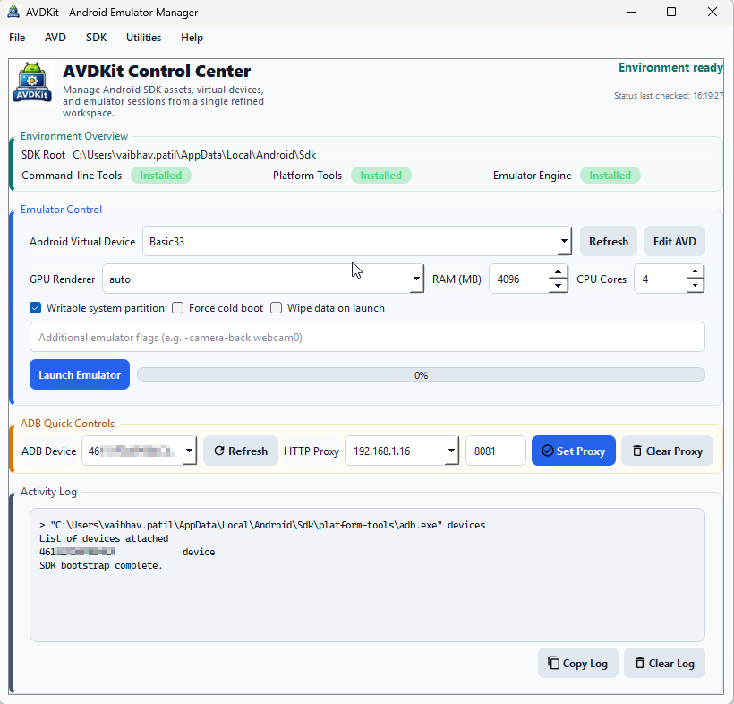

## Preferences

The Preferences screen provides a professional settings surface for application-wide configuration. It separates persistent environment settings from operational screens so the rest of the application can stay focused on daily workflows.

Typical workflow:

1. Open Preferences when SDK discovery or related application-level settings need review.
2. Adjust the required configuration values in one place.
3. Save the settings and return to the main application flow.

Why this matters:

- Keeps configuration centralized
- Reduces the need for manual environment adjustments outside the application
- Supports future growth as more preferences are added over time

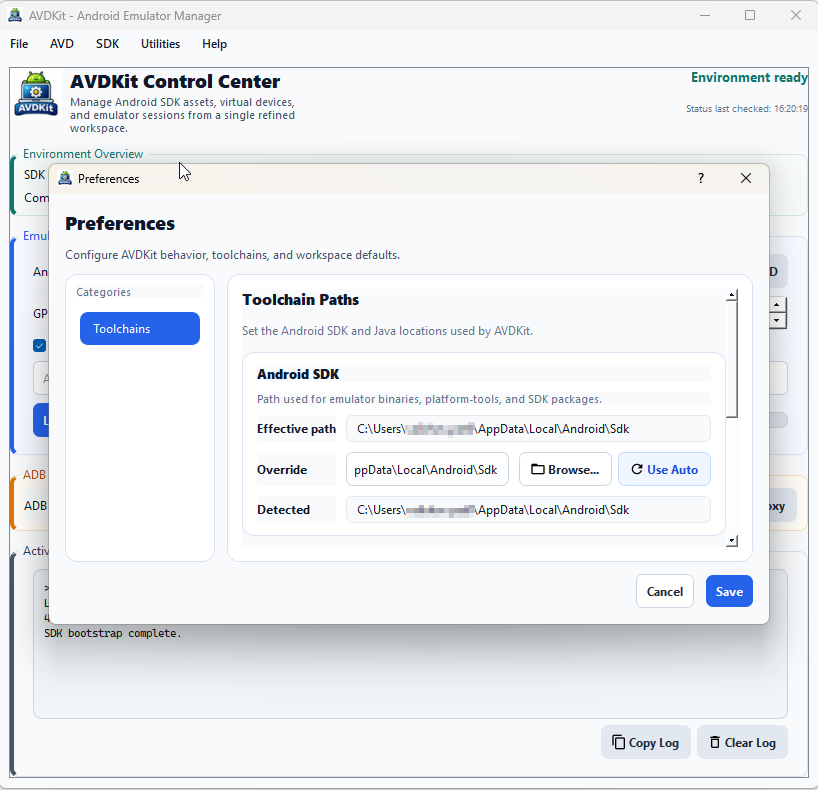

## Create AVD

The Create AVD workflow is designed to make virtual-device provisioning more direct. Instead of switching between SDK tools and manual steps, users can discover images, manage downloads, choose device profiles, and create an emulator from one guided flow.

Typical workflow:

1. Browse the available system-image catalog.
2. Filter or narrow the list to the required API level or image family.
3. Download the selected image if it is not already installed.
4. Enter the AVD name and choose a device profile.
5. Review output and status within the same screen.
6. Create the virtual device without leaving the workflow.

Why this matters:

- Speeds up creation of fresh emulator profiles
- Reduces friction when missing images need to be installed
- Keeps image selection and AVD creation tightly connected

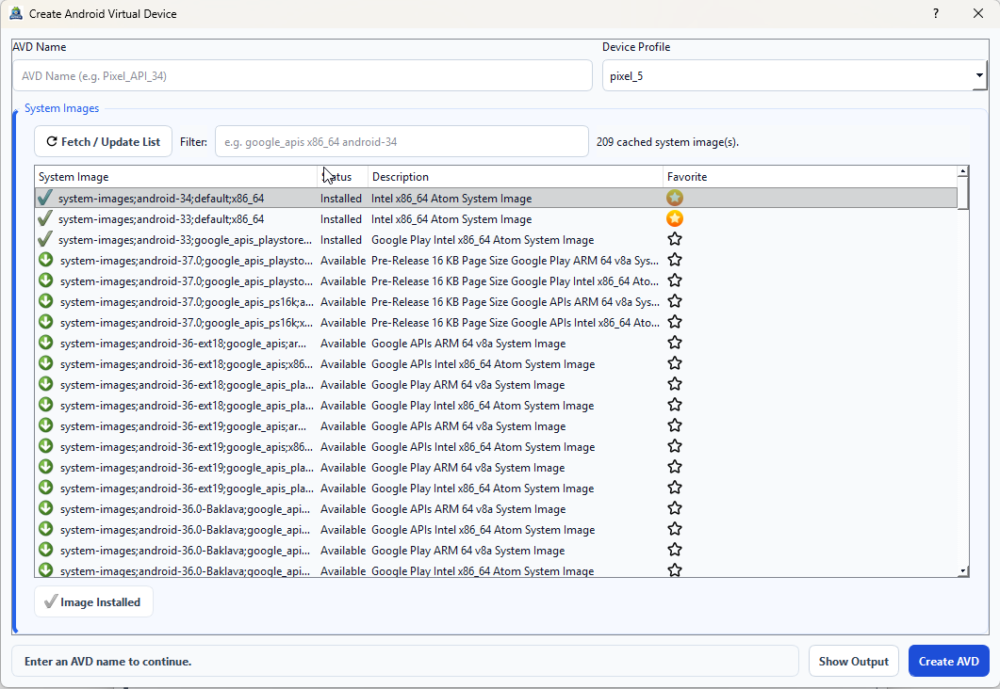

## Edit AVD

The Edit AVD screen is intended for maintaining and refining existing virtual devices. It gives users a clearer way to review and adjust emulator settings without depending on manual file edits.

Typical workflow:

1. Select an existing AVD.
2. Review its current configuration and device characteristics.
3. Modify settings such as startup behavior, display characteristics, hardware-related values, or general emulator options.
4. Save the updated configuration.
5. Return to launch the AVD with the revised settings.

Why this matters:

- Makes existing AVD profiles easier to maintain
- Supports repeated tuning of the same device definition
- Reduces errors that can happen with manual configuration changes

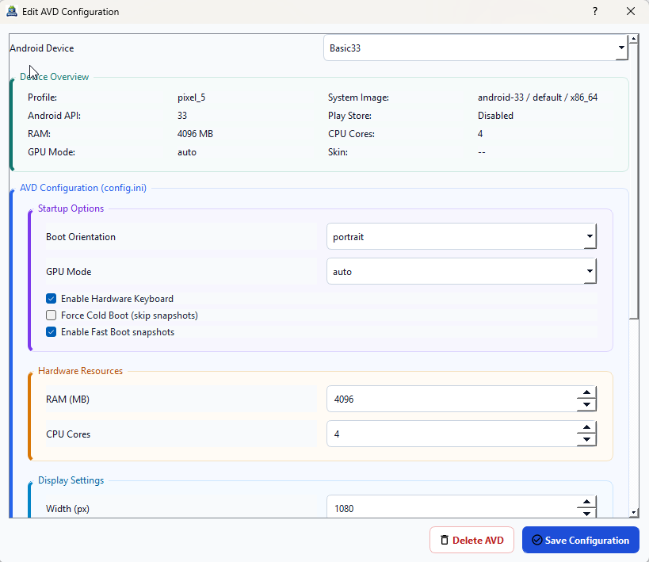

## ADB Device Manager

ADB Device Manager is the central screen for connected-device operations after an emulator or device is online. It groups together device summary information, deployment actions, proxy controls, file access, and diagnostic workflows into a single operational workspace.

Typical workflow:

1. Open the screen after the emulator or device is available.
2. Select the active device from the connected-device list.
3. Review core device information such as Android version, API level, root state, and storage status.
4. Apply or clear proxy settings for the selected device if traffic inspection is needed.
5. Install APKs, transfer files, capture logs, or record device output as needed.
6. Use the built-in file explorer to navigate device storage and retrieve relevant files.

Why this matters:

- Consolidates device-side tasks that are often spread across many commands
- Supports both operational testing and troubleshooting workflows
- Keeps device context visible while actions are being performed

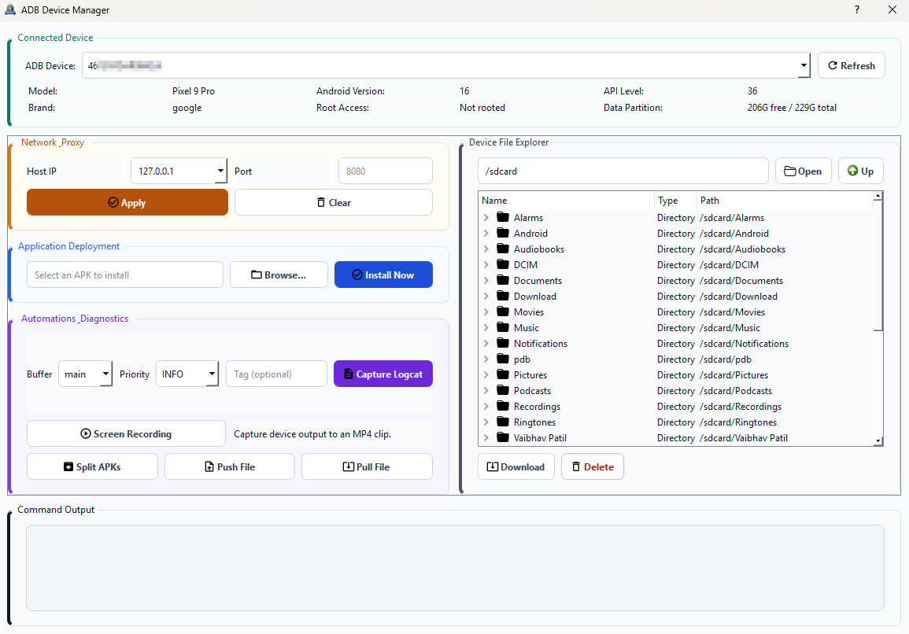

## APK Extraction

The APK Extraction workflow is intended for scenarios where installed applications need to be retrieved directly from a connected device or emulator for review, backup, or analysis.

Typical workflow:

1. Connect to the target device.
2. Search for the installed package by name or keyword.
3. Identify the correct application from the results.
4. Export the APK to local storage.

Why this matters:

- Simplifies retrieval of installed application packages
- Helps preserve the exact app version present on the test device
- Supports downstream analysis and archival workflows

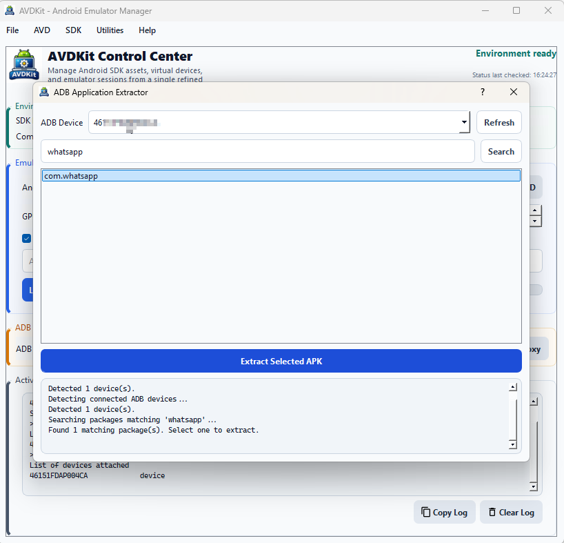

## Traffic Interceptor

The Traffic Interceptor workflow is intended to streamline proxy-based Android testing. It helps prepare the emulator environment for traffic capture and reduces repetitive setup effort across repeated sessions.

Typical workflow:

1. Choose the local host IP and relevant interception settings.
2. Prepare the device for proxy-based traffic routing.
3. Handle the required certificate-related preparation from the connected tooling flow.
4. Start the interception-oriented workflow and verify the setup.

Why this matters:

- Speeds up repeated traffic-inspection sessions
- Reduces manual proxy-configuration overhead
- Helps standardize interception setup across environments

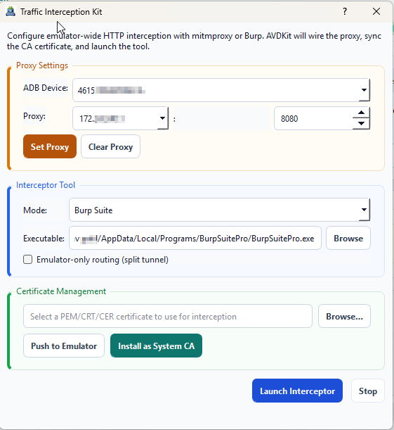

## System Certificate Manager

The System Certificate Manager supports Android-focused certificate preparation workflows so local interception certificates can be converted into a form suitable for device-side use.

Typical workflow:

1. Select the source certificate.
2. Convert it into the required Android-compatible format.
3. Review the generated output artifacts.
4. Use the resulting certificate in broader interception or rooted-device workflows.

Why this matters:

- Simplifies certificate-preparation steps that are often manual
- Reduces errors in conversion workflows
- Fits naturally into broader interception setup tasks

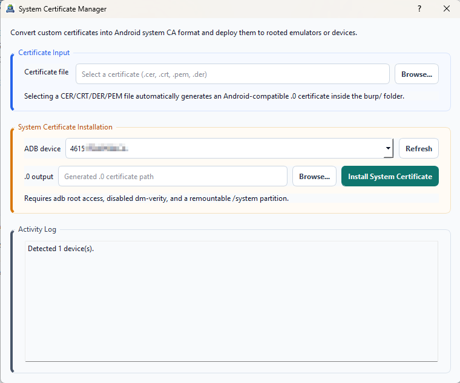

## TLS and SSL Pinning Analyzer

The TLS and SSL Pinning Analyzer is designed to support investigation of application trust behavior and pinning-related flows. It helps organize analysis steps that are otherwise fragmented across separate tools and manual procedures.

Typical workflow:

1. Select the target package or analysis target.
2. Start the TLS-analysis workflow.
3. Review runtime output related to TLS behavior and trust handling.
4. Use the result to guide follow-up runtime analysis or interception actions.

Why this matters:

- Helps focus TLS-related troubleshooting
- Supports faster iteration during app-network analysis
- Creates a cleaner workflow around certificate-validation investigation

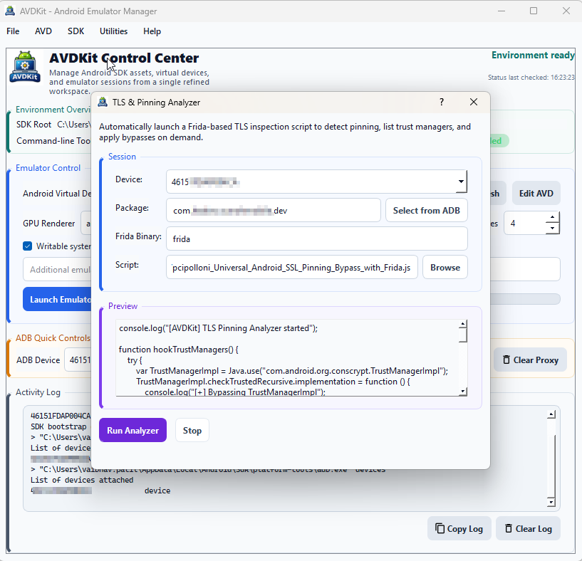

## Runtime Hook Launcher

The Runtime Hook Launcher is designed for repeatable instrumentation workflows. It helps users trigger prepared runtime-analysis actions from a guided interface instead of rebuilding the same process each time.

Typical workflow:

1. Select the target application or process.
2. Choose the appropriate hook or preset.
3. Launch the instrumentation workflow.
4. Review the output and repeat with additional actions as required.

Why this matters:

- Makes recurring runtime-analysis steps easier to reuse
- Reduces repetitive setup effort
- Supports more consistent instrumentation across sessions

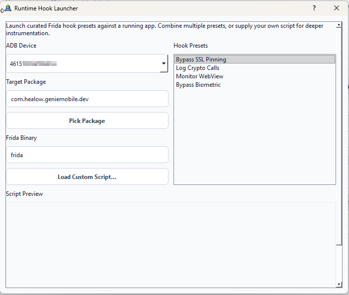

## Frida Utility

The Frida Utility provides a focused workspace for instrumentation-oriented tasks. It helps organize common Frida flows through a desktop UI rather than relying entirely on direct command-line handling.

Typical workflow:

1. Connect to the target device.
2. Identify the package or process of interest.
3. Load or prepare the instrumentation workflow.
4. Start the session and review the resulting output.

Why this matters:

- Improves usability for repeated instrumentation tasks
- Keeps setup and output in one place
- Supports faster iteration during live testing sessions

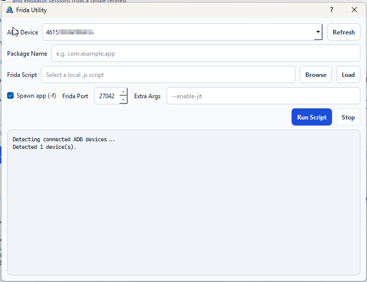

## Logcat Viewer

The Logcat Viewer provides a dedicated screen for reviewing Android logs inside the application. It supports issue investigation without requiring the user to leave the broader workflow context.

Typical workflow:

1. Choose the target device.
2. Start or refresh log capture.
3. Narrow the visible output using the relevant filters or context.
4. Review, retain, or save logs while reproducing the target behavior.

Why this matters:

- Keeps logs accessible during active testing
- Improves visibility during issue reproduction
- Supports debugging across other AVDKit workflows

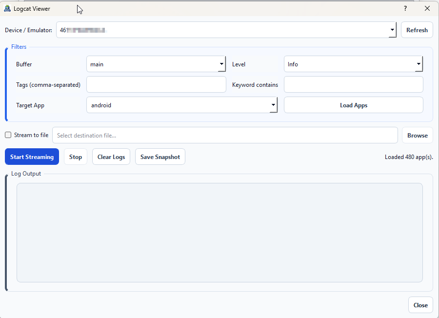

## Root AVD Workflow

The Root AVD workflow is intended for advanced emulator scenarios where elevated access is required. It focuses on guiding the user through a practical rooting flow in a more controlled way.

Typical workflow:

1. Select the target AVD.
2. Identify and select the matching `ramdisk.img`.
3. Start the guided rooting process that patches the ramdisk with Magisk.
4. Review status and output as the workflow completes.
5. Start the emulator with a cold boot so the patched image is applied cleanly.
6. Continue testing in the rooted emulator environment.

Why this matters:

- Simplifies a more advanced and error-prone emulator-preparation workflow
- Helps organize the sequence of rooting steps into a clearer process
- Supports research and testing scenarios that require deeper access

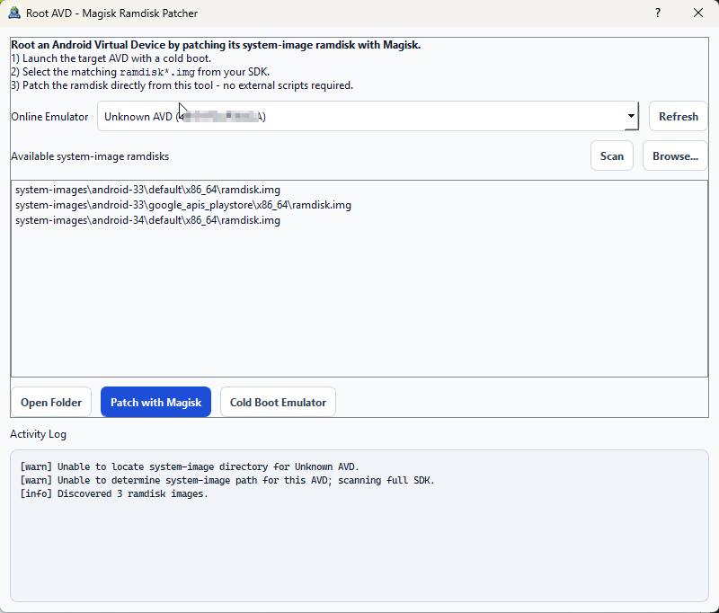

## Help and Navigation

The menu and navigation structure are intended to keep a broad toolset discoverable without crowding the main dashboard. Utilities remain easy to access while each task area stays focused.

Typical workflow:

1. Use the menu system to discover available tools and categories.
2. Open task-specific screens when a focused workflow is needed.
3. Return to the dashboard after completing the required operation.

Why this matters:

- Keeps the application organized
- Supports a wider feature set without overwhelming the main workspace
- Improves discoverability for less frequently used tools

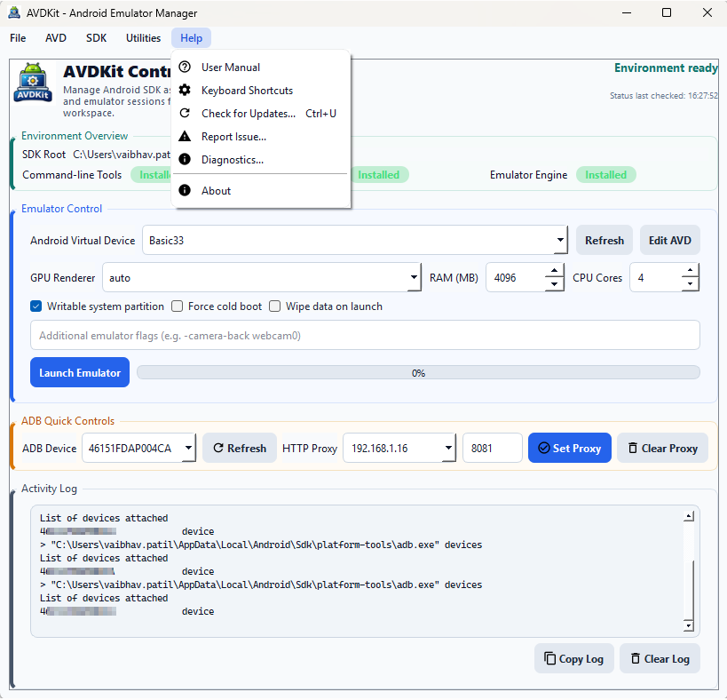

## Why Teams Use AVDKit

AVDKit is useful when Android emulator operations need to be repeated efficiently and consistently. Instead of moving between SDK tools, emulator controls, ADB commands, proxy setup, certificate preparation, logging, and runtime-analysis utilities, users can work through a unified desktop interface that keeps related actions grouped together.

Common use cases:

- Android application testing
- Emulator profile setup and management
- Proxy and traffic-inspection preparation
- Certificate conversion and deployment support
- TLS and trust-behavior investigation
- Runtime instrumentation workflows
- Rooted-emulator preparation for advanced scenarios

## 📣 Feedback & Issues

This is a public distribution repository.  
If you encounter any issues, bugs, or have feature suggestions, please feel free to open an issue.

Your feedback helps improve the stability and usability of AVDKit.
